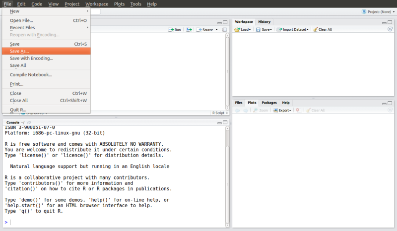
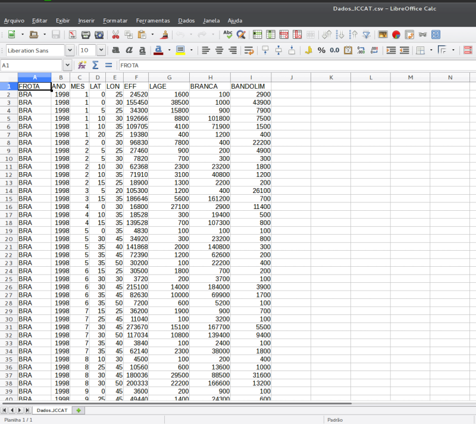

---
output:
   knitrBootstrap::bootstrap_document:
      title: "Curso R Intro - UNIVALI/2015"
      theme: Cosmo
      highlight: Dark
      theme.chooser: TRUE
      highlight.chooser: TRUE
---

<!-- BOOTSTRAP THEMES -->
<!-- Default, Amelia, Cerulean, Cosmo, Cyborg, Journal, Flatly, -->
<!-- Readable, Simplex, Slate, Spacelab, United --> 

<!-- HIGHLIGHTS -->
<!-- HighlightJs, Dark, Far, Idea, Sunburst, Zenburn, Visual Studio, -->
<!-- Ascetic, Magula, Github, Google Code, Brown Paper, School Book, IR -->
<!-- Black, Solarized - Dark, Solarized - Light, Arta, Monokai, Xcode, -->
<!-- Pojoaque, Rainbow, Tomorrow, Tomorrow Night, Tomorrow Night Bright, -->
<!-- Tomorrow Night Blue, Tomorrow Night Eighties --> 

```{r setup, include=FALSE}
opts_chunk$set(bootstrap.panel = TRUE,
               prompt = TRUE,
               comment = NA)
```

```{r, eval=FALSE, include=FALSE}
library(knitr)
library(knitrBootstrap)
library(rmarkdown)
```

<center>
# R: uma ferramenta de código aberto para análise de dados #
</center>

<br />

<center>
<p style="text-align:left;">
**Rodrigo Sant'Ana**
<span style="float:right;">
**Fernando Mayer**
</span>
</p>

<p style="text-align:left;">
UNIVALI/CTTMar/GEP 
<span style="float:right;">
UFPR/DEST/LEG
</span>
</p>

<p style="text-align:left;">
rsantana@univali.br
<span style="float:right;">
fernandomayer@gmail.com
</span>
</p>
</center>

***
***

## Introdução ##

Um breve histórico sobre o *software* R

1980. Linguagem S: desenvolvida por R. Becker, J. Chambers e A. Wilks
(AT&T Bell Laboratories);  

1980. Versão comercial: S-Plus (Insightful Corporation);  

1996. Versão livre: R desenvolvido por R. Ihaka e R. Gentleman
(Universidade de Auckland);  

1997. R Development Core Team;  

2015. 20 desenvolvedores principais e muitos outros colaboradores em
todo o mundo;  
	+ Core conta com Estatísticos, matemáticos e programadores;  
	+ Colaboradores indiretos de diferentes áreas do saber.  

***

## O que é o R? ##

1. Programa estatístico para análise de dados e produção gráfica;  
2. Uma completa linguagem de programação:
	* Interpretada (contrário de compilada);  
	* Orientada a objetos;  

> "Tudo no R é um objeto..."

3. Livre distribuição e código aberto;  
4. Mais de 6800 pacotes adicionais
[Pacotes R](http://cran-r.c3sl.ufpr.br/web/packages/);  
5. Disponível em [http://R-project.org](http://R-project.org);  
6. Versão atual: R-3.2.1 (18-06-2015);  
	* versões menores - lançamentos semestrais;  
	* versões maiores - lançamentos anuais.  

***

## Vantagens ##

* É um *software* livre;  
* Funciona em praticamente todos os sistemas operacionais existentes;
	- Linux, FreeBSD, Macintosh e Windows;
* É um produto de cooperação entre estatísticos do mundo todo;  
* Linguagem lógica e intuitiva;  
* Flexibilidade nas análises estatísticas;  
* Gráficos de alta qualidade;  
* Pesquisas reproduzíveis.  

***

## Desvantagens ##

* Sem interface gráfica (?);  
* Não há visualização direta dos dados;  
* Curva de aprendizado longa;  
* Pode ser lento com grandes bases de dados (alguns GB e/ou TB de
  dados);  
	  - estes casos necessitam vetorização.

***

## Configuração Inicial ##

Passo a passo para iniciar um trabalho com R:

1. Crie um diretório de trabalho onde serão armazenados os dados,
códigos R e saídas das análises que serão realizadas nesta pesquisa;

2. Utilizando o menu do RStudio, direcione o *software* para a pasta
recentemente criada. Para isto, clique em

> Session >> Set Working Directory >> Choose Directory

e direcione sua escolha para pasta criada anteriormente.

3. Para conferir o diretório que você está trabalhando, utilize a função
   do R _"getwd()"_

```{r}
getwd()
```

***

## Visão Geral - Entendendo o R ##

### Prompt de comando ou console R ###

O símbolo *">"* indica que o R está pronto para receber um novo
comando. _Ready to work!!_

O símbolo no prompt de comando (ou console) do R muda de ">" para "+"
para indicar ao usuário que o comando enviado está incompleto.


Teste em seu computador os seguintes comandos abaixo:

```{r}
## Somando escalares...
2 + 2

## Múltiplicando escalares...
2 *
    2

## Dividindo escalares...
2 /                                      2
```

Notem que os espaços entre os números não fazem diferença para o R.

***

### Editor de scripts ###

* Utilizado para criar rotinas computacionais de análises;
* Para acessar o editor de scripts do RStudio navegue pelo menu da
aplicação, clicando em:

> Arquivo >> Novo script.

nomeie conforme desejado e salve o script com a extensão .R;



* Para envio rápido dos comandos digitados no "Editor de script" do
RStudio diretamente para o "Console" do R é possível utilizar o atalho
Ctrl + R;

* Para adicionar comentários/anotações ao script que não fazem parte dos
  comandos utilizados nas análises, utiliza-se o símbolo "#" antes do
  texto desejado. O que estiver depois do símbolo não será interpretado
  pelo R. Portanto:

```{r}
2 + 2 ### Esta linha será executada, porém o comentário não.
## 2 + 2 Esta linha será totalmente ignorada pelo R.
```

***

### Mecanismos de ajuda no R ###

Memorizar todos os comandos do R é praticamente impossível. Para
auxiliar nesta tarefa, o R possui uma estrutura completa de pesquisa
sobre temas correlatos às funções existentes em seus pacotes. 

A função _"help.search()"_ ajuda o usuário na busca por um determinado
tema de interesse dentro da base do R ou em um pacote adicional
específico. Trata-se de uma pesquisa às bases de documentos do R através
de uma pesquisa por palavra-chave (*em inglês*).

```{r, eval=FALSE}
### Pesquisa utilizando a função completa
help.search("linear models")

### Pesquisa utilizando a função resumida
??"linear models"
```

Ou ainda, podemos pesquisar sobre uma função ou comando de nome
conhecido, através da função _"help()"_ presente no *software* R.

```{r, eval=FALSE}
### Pesquisa utilizando a função completa
help(mean)

### Pesquisa utilizando a função resumida
?mean
```
Outras formas de pesquisa no R, que podem auxiliar bastante no dia-a-dia
são:

1. Ajuda através do navegador (contendo também os manuais dos pacotes e
funções);

```{r, eval=FALSE}
help.start()
```

2. Busca por tema ou palavra nos arquivos da lista de discussão do R na
World Wide Web.

```{r, eval=FALSE}
RSiteSearch("linear models")
```

***

## Orientação a objetos no R ##

O que é um objeto no R?

* Um *símbolo* ou uma *variável* capaz de armazenar qualquer valor ou
estrutura de dados no R.

Por quê objetos?

* Uma maneira simples de acessar os dados armazenados na memória da CPU
(o R não permite acesso direto à memória).

```{r}
### Atribuindo um valor ao objeto "x". x recebe o valor 2.
x <- 2

### Realizando uma operação de adição entre o objeto x e o escalar 2.
x + 2

### Qual o valor de x?
x
```

## Estrutura de dados no R ##

Estrutura de programação no R:

* Objetos -> Classes -> Métodos

> "Tudo no R é um objeto."

> "Todo objeto no R tem uma classe"

_Classe_ é a definição de um objeto. Descreve a forma do objeto e como
ele será manipulado pelas diferentes funções do R.

_Método_ são funções genéricas que executam suas tarefas de acordo com
a classe de cada objeto.

A organização dos dados no R podem ser organizadas de maneiras
distintas, as principais estruturas existentes são:

Estrutura | Descrição | Função
----------|-----------|--------
vector    | Vetor de dados com um ou mais elementos de mesmo tipo | _"c()"_
matrix    | Matriz de dados com duas dimensões e um único tipo de dado | _"matrix()"_
data.frame | Similar à estrutura da matriz, porém permite colunas com diferentes tipos de dados | _"data.frame()"_
list | Objeto que permite combinar diferentes estruturas de dados em um único objeto | _"list()"_


```{r}
### Exemplo de vetor no R
vet <- c(2, 3, 55, -4)
vet

### Exemplo de matriz no R
mat <- matrix(c(2, 0, 10, -5), nrow = 2)
mat

### Exemplo de data frame no R
dat <- data.frame(local = c("A", "B", "C"), N = c(10, 24, 5))
dat

### Exemplo de list no R
lst <- list(vet, mat, dat)
lst

```

## Tipos de dados no R ##

No R, os dados podem assumir diferentes tipos, tais como:

Tipo         | Descrição
-------------|-----------
character    | Texto ou caracter
numeric      | Números inteiros ou reais
logical      | Booleano ou Verdadeiro/Falso (TRUE/FALSE)
complex      | Números complexos
date         | Datas
factor       | Texto ou caracter estruturado em níveis

***

### Nomeando os objetos no R ###

Dicas e considerações importantes para nomenclatura de objetos no R:

* Os objetos podem ser formados por letras, números e ".", "_", "-";
* Não podem iniciar com números e/ou ".", "_", "-";
* Não podem conter espaços;
* Evite, ao máximo, utilizar acentos;
* Evite também o uso de nomes de funções do R, tais como:
	c q t C D F I T diff df data var pt
* O R é case-sensitive, portanto: <br />
		*dados* $\neq$ *Dados* $\neq$ *DADOS*

### Listando e removendo objetos da área de trabalho do R ###

Uma vez que temos inúmeros objetos criados em nossa área de trabalho do
R, podemos listar e observar este objeto. O comando que auxilia nesta
tarefa é o _"ls()"_, abreviação da palavra (em inglês) *list*.

```{r}
### Criando alguns objetos
x <- 2
y <- 3
z <- 4

### Listando objetos já existentes em nossa área de trabalho
ls()
```
E o que acontece se atribuirmos um novo valor à um objeto que já existe
em nossa área de trabalho?

```{r}
### Atribuindo um novo valor para x
x <- 362

### Imprimindo o objeto x
x
```

E para remover objetos desnecessários existentes em nossa área de
trabalho? o comando _"rm()"_, abreviação da palavra inglesa *remove* é
utilizado para este fim. Para usá-lo, basta fornecer o nome do objeto a
ser removido, exemplo:

```{r}
### Removendo o objeto x da lista de objetos existentes na área de
### trabalho do R
rm(x)
```

**Prática com R**

1. Crie um objeto de nome *x* no R e armazene neste o resultado da
   seguinte equação: 32 + 16^2 - 25^3;

Importante:

Operador   | Significado
-----------|------------
+          | adição
-          | subtração
*          | multiplicação
/          | divisão
^          | potência
exp()      | exponencial
sqrt()     | raíz quadrada
factorial()| fatorial
log()      | logaritmo

2. Divida *x* por 345 e armazene este novo resultado em um novo objeto
chamado *y*.

3. Visualize os valores armazenados nos objetos *x* e *y* criados
   anteriormente, confira se os valores alcançados foram -15337 para *x*
   e -44,45507.

4. Por fim, remova os objetos *x* e *y* de sua área de trabalho.

***

## Carregando dados no R ##

Existem inúmeras formas de carregar/importar dados para o R. A maneira
mais simples e comum é utilizar uma Planilha Eletrônica para
armazenamento das informações, estruturando as variáveis em colunas e
as observações em linhas.



Esta planilha deve ser salva no formato csv, arquivo de texto separado
por virgula, e na mesma pasta criada para armazenar os arquivos que
farão parte do escopo do trabalho em questão. Com isso, no R, o comando
para importação é o _"read.table()"_.

```{r}
### Importando uma planilha de dados para o R.
dados <- read.table("Dados_ICCAT.csv", header = TRUE, sep = ";",
                    dec = ",")
```
***

## Visualizando os dados importados no R ##

Como visto antes, uma desvantagem do R é a não visualização em tempo
real dos seus dados. Uma alternativa é utilizar a função ou comando
_"head()"_ do R. Este comando retorna as 6 primeiras linhas do objeto
desejado.

```{r}
### Visualizando as 6 primeiras linhas do objeto "dados" criado
### anteriormente.
head(dados)
```
Lembrando que todo objeto tem uma classe no R, como visualizar o tipo de
classe do objeto dados? A função _"class()"_ do R auxilia
nisto. Recordando ainda que, cada variável possui um tipo, como
visualizar os tipos de dados presentes em nosso objeto? Ou melhor, como
que o R interpretou os dados importados da Planilha Eletrônica? O
comando _"str()"_ é uma alternativa para esta compreensão.

```{r}
### Visualizando a classe do objeto dados.
class(dados)

### Visualizando a estrutura dos dados presentes no objeto dados.
str(dados)
```

Uma alternativa mais informativa, porém ainda rápida, pode ser acessada
pela função _"summary()"_ do R. Esta função traz um sumário estatístico
de cada variável presente no objeto, respeitando as respectivas
tipificações.

```{r}
### Sumário das variáveis presentes no objeto dados.
summary(dados)
```
***

## Manipulação de dados ##

### Indexação ###

Como visualizar posições específicas em nossos dados? O R, assim como
outras linguagens de programação científica, trabalha com indexação
algébrica, ou seja, orientação de posicionamento por indexação de
vetores e matrizes.

Assim, em um vetor de dados (estrutura unidimensional) cada uma das
observações presentes neste vetor possui um índice de posição
único. Exemplo:

```{r}
### Vetor com 10 valores inteiros
vet <- c(1, 2, 5, 10, 9, 7, 3, 8, 6, 4)

### Qual o valor na posição 4?
vet[4]

### Qual o valor na posição 9?
vet[9]
```

No caso de uma matriz de dados (estrutura bidimensional) cada uma das
observações presentes nesta matriz possui um índice composto de
indicador de linha e indicador de coluna. Exemplo:

```{r}
### Matriz com os mesmos valores presentes no vetor "vet".
mat <- matrix(vet, nrow = 5)

### Qual o valor presente na linha 2 e coluna 2?
mat[2, 2]

### Qual o valor presente na linha 5 e coluna 2?
mat[5, 2]

### Quais os valores presentes na linha 5 em todas as colunas?
mat[5,]

### Quais os valores presentes em todas as linhas da coluna 1?
mat[,1]
```

O mesmo comportamento observado na indexação de matrizes pode ser
utilizado para objetos da classe data.frame.

```{r}
### Utilizando o objeto dados importado anteriormente, qual o valor da
### linha 2 e coluna 3
dados[2,3]

### Qual os valores da coluna 3 em todas as linhas
dados[,3]
```

No entanto, objetos da classe data.frame tem uma alternativa melhor para
indexação de valores. O nome das variáveis. As colunas de um data.frame
podem ser acessadas com o auxilio do símbolo *$*. Exemplo:

```{r}
### Quais os valores da coluna 3 do objeto dados? Para responder,
### precisamos saber qual o nome da coluna 3, para visualizar os nomes
### das colunas de um objeto temos duas alternativas: 1) utilizar a
### função head() como vimos antes, ou; 2) utilizar a função names() que
### traz um vetor com os nomes das variáveis.

### Utilizando a função head
head(dados)

### Utilizando a função names
names(dados)

### Coluna 3 = MES, quais os valores da coluna MES do objeto dados
### então?
dados$MES

### Qual o valor da segunda linha da coluna ANO do objeto dados?
dados$ANO[2]
```

### Seleção condicional ###

Pensando no exemplo da objeto "dados", se quisessemos criar uma nova
variável - "Trimestre", como poderíamos fazer isto?

```{r}
### Criando a nova variável no objeto dados, chamada Trimestre e
### preenchendo as observações com o valor 1
dados$Trimestre <- 1

### Considerando que o segundo Trimestre de cada ano é composto pelos
### meses 4, 5 e 6, poderíamos implementar uma seleção condicional, de
### forma que a coluna Trimestre, onde os meses foram iguais a 4, 5 e 6
### receba o valor 2.
dados$Trimestre[dados$MES == 4 | dados$MES == 5 | dados$MES == 6] <- 2

### Repetindo esta mesma lógica para os demais trimestres, temos a
### variável trimestre criada em nossa base de dados.
dados$Trimestre[dados$MES == 7 | dados$MES == 8 | dados$MES == 9] <- 3
dados$Trimestre[dados$MES == 10 | dados$MES == 11 | dados$MES == 12] <- 4
```
***

## Estatística Descritiva ##

Observando medidas de centro - Média e Mediana

```{r}
### Média e mediana das capturas de Albacora Lage
mean(dados$LAGE)
median(dados$LAGE)

### Média e mediana das capturas de Albacora Branca
mean(dados$BRANCA)
median(dados$BRANCA)

### Média e mediana das capturas de Albacora BANDOLIM - Ops!!!
mean(dados$BANDOLIM)
median(dados$BANDOLIM)
```

Na presença de dados faltantes em nossa base de dados, o R por padrão
retorna a indicação desta inconsistência em nossos dados. Para
contornarmos este problema, grande parte das funções do R possuem o
argumento _"na.rm"_ para resolver esta particularidade.

```{r}
### Média e mediana das capturas de Albacora BANDOLIM - Ops!!!
mean(dados$BANDOLIM, na.rm = TRUE)
median(dados$BANDOLIM, na.rm = TRUE)
```

E se quisessmos calcular a média das capturas das três espécies
trimestralmente, como poderíamos fazer isto de forma rápida?

```{r}
### Calculando a média das capturas das três espécies por trimestre.
aggregate(cbind(LAGE, BRANCA, BANDOLIM) ~ Trimestre, data = dados,
          FUN = mean, na.rm = TRUE)
```
Aumentando a estratificação da estimação, se quisessemos estimar agora a
média das capturas de Albacora bandolim por ANO e TRIMESTRE?

```{r}
### Calculando a média das capturas de Albacora bandolim por ANO e
### TRIMESTRE.
tapply(dados$BANDOLIM, list(dados$ANO, dados$Trimestre),
       FUN = mean, na.rm = TRUE)
```

Poderíamos aumentar ainda mais a estratificação das estimações,
colocando mais uma dimensão na solicitação, estimando agora a captura
média de Albacora branca por ANO, MES e FROTA.

```{r}
### Calculando a média das capturas de Albacora branca por ANO, MES e
### FROTA.
tapply(dados$BRANCA, list(dados$ANO, dados$MES, dados$FROTA),
       FUN = mean, na.rm = TRUE)
```

Observando medidas de variação - Desvio padrão, Variância, Coeficiente
de variação.

```{r}
### Desvio padrão
sd(dados$BRANCA)

### Variância
var(dados$BRANCA)
sd(dados$BRANCA)^2

### Coeficiente de variação
sd(dados$BRANCA)/mean(dados$BRANCA)
```

Observando medidas de posição relativa - Quartís e Decís.

```{r}
### Quartís
quantile(dados$BRANCA)

### Decís
quantile(dados$BRANCA, probs = seq(0, 1, 0.1))
```

Observando resumo dos dados em termos de quantificações (contagens) por
fatores ou observações - Tabelas de contingência.

```{r}
### Tabela de contingência
table(dados$FROTA)

### Tabela de contingência cruzada
table(dados$FROTA, dados$Trimestre)
table(dados$ANO, dados$MES)
```

Transformando tabelas de contingências em observações gráficas.

```{r}
barplot(table(dados$Trimestre, dados$ANO), beside = T)
mosaicplot(table(dados$Trimestre, dados$ANO))
table(dados$ANO, dados$Trimestre, dados$FROTA)
mosaicplot(table(dados$ANO, dados$Trimestre, dados$FROTA))
```

<!-- ```{r} -->
<!-- ## Uma forma mais eficiente - usando lattice -->
<!-- require(lattice) # para carregar o pacote -->
<!-- histogram(~BRANCA | FROTA, data = dados, as.table = TRUE, -->
<!--           layout = c(1,2)) -->
<!-- histogram(~BRANCA | factor(ANO) + factor(Trimestre), data = dados, -->
<!--           as.table = TRUE) -->
<!-- histogram(~BRANCA | factor(Trimestre) + factor(ANO), data = dados, -->
<!--           as.table = TRUE) -->
<!-- histogram(~BRANCA | factor(ANO) + FROTA, data = dados, -->
<!--           as.table = TRUE) -->
<!-- histogram(~BRANCA | factor(Trimestre) + FROTA, data = dados, -->
<!--           as.table = TRUE) -->
<!-- histogram(~BRANCA | factor(Trimestre) + factor(ANO) + FROTA, -->
<!--           data = dados, as.table = TRUE) -->
<!-- ``` -->
<!-- *** -->


