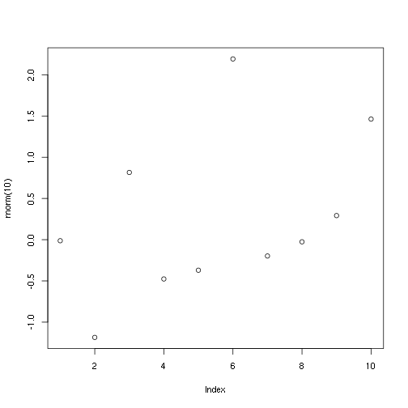

---
title       : Curso R Intro
subtitle    : Docentes UNIVALI/2015
author      : Rodrigo Sant'Ana
job         : Professor
framework   : io2012        # {io2012, html5slides, shower, dzslides, ...}
highlighter : highlight.js  # {highlight.js, prettify, highlight}
hitheme     : tomorrow      # 
widgets     : []            # {mathjax, quiz, bootstrap}
mode        : selfcontained # {standalone, draft}
--- &hero

## Introdução 


```r
rnorm(10)
```

```
##  [1]  0.5613744  0.1794159  0.1256914 -0.4824314 -0.2235932 -1.9256864
##  [7] -0.5111974  0.4657774  0.0366461  0.5443374
```
--- .class #id

## Slide 2


```r
plot(rnorm(10))
```

 
--- .class #id2

## Slide 3


```r
sessionInfo()
```

```
## R version 3.2.0 (2015-04-16)
## Platform: x86_64-unknown-linux-gnu (64-bit)
## Running under: Manjaro Linux
## 
## locale:
##  [1] LC_CTYPE=pt_BR.utf8       LC_NUMERIC=C             
##  [3] LC_TIME=pt_BR.utf8        LC_COLLATE=pt_BR.utf8    
##  [5] LC_MONETARY=pt_BR.utf8    LC_MESSAGES=pt_BR.utf8   
##  [7] LC_PAPER=pt_BR.utf8       LC_NAME=C                
##  [9] LC_ADDRESS=C              LC_TELEPHONE=C           
## [11] LC_MEASUREMENT=pt_BR.utf8 LC_IDENTIFICATION=C      
## 
## attached base packages:
## [1] stats     graphics  grDevices utils     datasets  methods   base     
## 
## other attached packages:
## [1] knitr_1.10.5    slidify_0.4.5   lattice_0.20-31
## 
## loaded via a namespace (and not attached):
##  [1] compiler_3.2.0   magrittr_1.5     formatR_1.2      markdown_0.7.7  
##  [5] tools_3.2.0      whisker_0.3-2    yaml_2.1.13      codetools_0.2-11
##  [9] stringi_0.5-5    grid_3.2.0       digest_0.6.8     stringr_1.0.0   
## [13] evaluate_0.7
```

--- .class #id3
